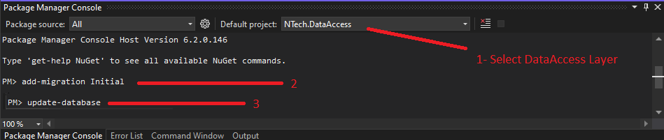

# NTechBackend

⬇️ Used Technologies ⬇️
<ul>
  <li>Autofac</li>
  <li>Serilog</li>
  <li>FluentValidation</li>
  <li>RabbitMq</li>
  <li>Hangfire and BackgroundService</li>
  <li>Redis Cache</li>
  <li>Microsoft Memory Cache</li>
  <li>AutoMapper</li>
  <li>EntityFrameworkCore</li>
  <li>JWT</li>
</ul>
<hr>
Async Programming ⚙️<br>
Aspect Oriented Programming ⚙️ <br>
Hashing Password 🔑 <br>
Email Service 📧 <br>
<hr>
Cache and Cache Remove Aspects 🧰 <br>
Performance Aspects 🚀 <br>
Validation Aspects ✔️ <br>
Secure Aspects 🛡️ <br>
Log Aspects 📓 <br>
Exception Log Aspects ❌ <br>

<hr>
<h2>Startup</h3>
<h4>⬇️ Connection Strings in appsettings.json ⬇️</h4>

```json
"ConnectionStrings": {
    "SqlServer": "Server=DESKTOP-HVLQH67\\SQLEXPRESS;Database=NTechDb;integrated security=true",
    "PostgreSql": "User ID=postgres;Password=123;Host=localhost;Port=5432;Database=NTechDb;"
  },
```
<h4>⬇️ UseSqlServer or UseNpgsql in program.cs ⬇️</h4>

```c#
#region SqlContext, PostgreContext
//builder.Services.AddDbContext<NTechDbContext>(options => options.UseSqlServer(builder.Configuration.GetConnectionString("SqlServer")));
builder.Services.AddDbContext<NTechDbContext>(options => options.UseNpgsql(builder.Configuration.GetConnectionString("PostgreSql")));

builder.Services.AddScoped<DbContext, NTechDbContext>();
#endregion
```



<h4>⬇️ Jwt Options in appsettings.json ⬇️</h4>

```json
"AccessTokenOptions": {
    "Audience": "emir57",
    "Issuer": "www.ntech.com.tr",
    "AccessTokenExpiration": 60,
    "SecurityKey": "nCsFlhJlNp62k1iM49q2-+?caSrvNte"
  }
```
<h4>⬇️ Redis Configuration in appsettings.json ⬇️</h4>

```json
"RedisConfiguration": {
    "Host": "localhost",
    "Port": 49153,
    "Password": "redispw"
  }
```
<h4>⬇️ Email Configuration in appsettings.json ⬇️</h4>

```json
"EmailConfiguration": {
    "Port": 587,
    "Server": "smtp.office365.com",
    "EnableSsl": true,
    "Username": "username@hotmail.com",
    "Password": "***"
  }
```
<h4>⬇️ RabbitMq Configuration in appsettings.json ⬇️</h4>

```json
"MessageBrokerOptions": {
    "HostName": "localhost",
    "UserName": "admin",
    "Password": "123456"
  }
```
<h4>⬇️ SeriLog Configuration in appsettings.json ⬇️</h4>

```json
"SeriLogConfigurations": {
    "FileLogConfiguration": {
      "FolderPath": "/logs/"
    }
  }
```
<h4>⬇️ Upload Image Path in appsettings.json ⬇️</h4>

```json
"UploadImagePath": "wwwroot/images/"
```


<hr>

<h2>
<a href="https://documenter.getpostman.com/view/17832908/VUjTkiTt#816019f3-f6ca-436f-9a17-faa58d9e2e06">Postman Documentation</a>
</h2>
